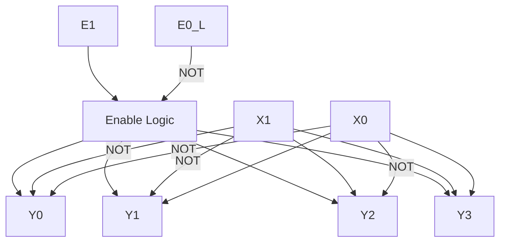
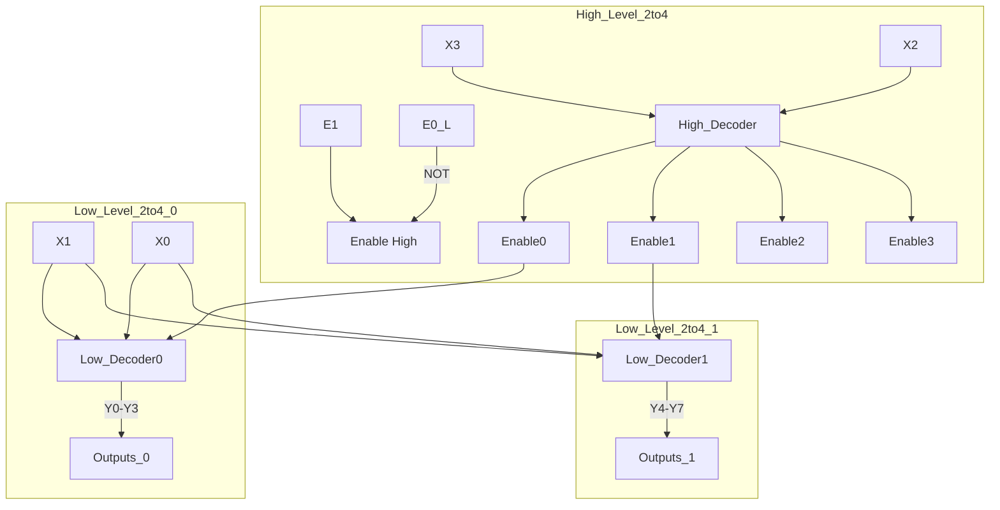

### Project Documentation: Design and Implementation of Binary Decoders

# Table of Contents

## Table of Contents
1. [Introduction](#introduction)
2. [Project Objectives](#project-objectives)
3. [Design and Implementation of Binary Decoders](#design-and-implementation)
4. [Implementing a Boolean Function Using a Decoder](#implementing-boolean-function)
5. [Part II: Implementation of a Boolean Function with 4:16 Decoder](#part-ii)
6. [Conclusion](#conclusion)
7. [Appendix](#appendix)


# Introduction

This project involves the design, implementation, and simulation of binary decoders using Quartus Prime software. The goal is to create a 2:4 binary decoder, expand it into a 4:16 decoder using hierarchical design, and implement a specific Boolean function using the decoders.

# Project Objectives

- Design a 2:4 binary decoder with two data inputs, two enable inputs (one active high and one active low), and four data outputs.
- Implement the 2:4 decoder in Quartus Prime using both schematic and Verilog HDL approaches.
- Simulate the 2:4 decoder to verify its functionality.
- Design a 4:16 binary decoder using multiple 2:4 decoders as building blocks.
- Implement and simulate the 4:16 decoder in Quartus Prime.
- Implement a given Boolean function using the 4:16 decoder and additional logic gates.
- Document the entire design process, including code listings, simulations, and logic diagrams.

# 3. Design and Implementation of Binary Decoders

## 3.1 Design of a 2:4 Binary Decoder

Design a 2:4 binary decoder, with 2 data inputs (X1 and X0), 4 data outputs (Y3...Y0) and 2 enable inputs, one active high (E1) and the other active low (E0_L). Its interface is shown in Fig. 1.

### Truth Table

| E1 | E0_L | X1 | X0 | Y3 | Y2 | Y1 | Y0 |
|----|------|----|----|----|----|----|----|
| 0  | X    | X  | X  | 0  | 0  | 0  | 0  |
| X  | 1    | X  | X  | 0  | 0  | 0  | 0  |
| 1  | 0    | 0  | 0  | 0  | 0  | 0  | 1  |
| 1  | 0    | 0  | 1  | 0  | 0  | 1  | 0  |
| 1  | 0    | 1  | 0  | 0  | 1  | 0  | 0  |
| 1  | 0    | 1  | 1  | 1  | 0  | 0  | 0  |

### Boolean Equations

- \(Y_0 = E_1 \cdot \overline{E_0_L} \cdot \overline{X_1} \cdot \overline{X_0}\)
- \(Y_1 = E_1 \cdot \overline{E_0_L} \cdot \overline{X_1} \cdot X_0\)
- \(Y_2 = E_1 \cdot \overline{E_0_L} \cdot X_1 \cdot \overline{X_0}\)
- \(Y_3 = E_1 \cdot \overline{E_0_L} \cdot X_1 \cdot X_0\)


## 3.2 Quartus Prime Implementation of the 2:4 Decoder

Using the Quartus Prime software, create a new project named "DecoderDemo", with a top-level entity with the same name as the project. Create a new file for a schematic diagram called "Dec2_4.bdf" to implement the decoder based on logic gates, accordingly to the logic diagram of the previous point. Create a symbol for the "Dec2_4" module, so that it can be used in a schematic diagram, and save it with the name "Dec2_4.bsf".

### Logic Diagram 




## 3.3 Behavioural Simulation of the 2:4 Decoder

Create a new file for a schematic diagram called "DecoderDemo.bdf" that will act as the top-level of the project, instantiate the decoder built in the previous point and connect it to input and output ports.

### Simulation Setup

- **Inputs:** E1, E0_L, X1, X0
- **Outputs:** Y3, Y2, Y1, Y0
- **Stimuli:** Applied all possible combinations of inputs.

### Results

- The outputs matched the expected values from the truth table.


## 3.4 Design of a 4:16 Binary Decoder

Create a 4:16 binary decoder using the 2:4 binary decoder as a building block. Its interface is shown in Fig. 2 and consists of 4 data inputs (X3...X0), 16 data outputs (Y15...Y0) and 2 enable inputs, one active high (E1) and the other active low (E0_L). Draw the logic diagram of the 4:16 decoder based on 2:4 binary decoder modules.


### Logic Diagram 




## 3.5 Quartus Prime Implementation of the 4:16 Decoder

Create a new file for a schematic diagram called "Dec4_16.bdf" to implement the 4:16 decoder, accordingly to the logic diagram of the previous point. Create a symbol for the "Dec4_16" module, so that it can be used in a schematic diagram, and save it with the name "Dec4_16.bsf".


## 3.6 Behavioural Simulation of the 4:16 Decoder

Create a new file for a schematic diagram called "DecoderDemo2.bdf" and select it as the new top-level of the project, instantiate the 4:16 decoder built in the previous point and connect it to input and output ports.

### Simulation Setup

- **Inputs:** E1, E0_L, X[3:0]
- **Outputs:** Y[15:0]
- **Stimuli:** Applied all 16 combinations of inputs.

### Results

- For each input combination, the corresponding output Y was high, verifying correct decoder operation.


# 4. Implementing a Boolean Function Using a Decoder

## 4.1 Analysis of the Boolean Function

**Given Function:**

\[ f(A, B, C, D) = A' \cdot B \cdot C + A \cdot D + A \cdot C \]

### First Canonical Form

- **Minterms where f is 1:** \(m(4, 5, 6, 7, 12, 13, 14, 15)\)

### Karnaugh Map

[Placeholder for Karnaugh Map of the Function]

# 5. Part II: Implementation of a Boolean Function with 4:16 Decoder

## 5.1 Analysis of Boolean Function and Canonical Form

Draw the corresponding Karnaugh map and determine the first canonical form of the function \(f(A, B, C, D)\).

[Placeholder for Karnaugh Map of Boolean Function]

## 5.2 Implementation in Quartus Prime

Create a new file for a schematic diagram called "DecoderDemo3.bdf" and select it as the new top-level of the same project used in Part I. Instantiate a 4:16 decoder with the additional OR gate(s), as drawn in the previous point, to implement \(f(A, B, C, D)\).

[Placeholder for implementation details and screenshots]

### Logic Diagram in Mermaid

```mermaid
graph TD;
    Decoder[4:16 Decoder] --> Outputs;
    OR_Gate[OR Gate] --> Outputs;
    Outputs --> f[f(A, B, C, D)];
```

[Placeholder for Quartus Prime schematic diagram of the Boolean function implementation]

## 5.3 Simulation

Simulate "DecoderDemo3.bdf" and check its behavior for all the possibilities of the \(f(A, B, C, D)\) truth table.
3_vwf_result_boolean.png

# Conclusion

The project successfully demonstrates the design and implementation of binary decoders using both schematic and HDL approaches. The 2:4 decoder was built and verified, and then used as a building block to create a 4:16 decoder. The 4:16 decoder was utilized to implement a specific Boolean function, showcasing the practical application of decoders in digital logic design.

